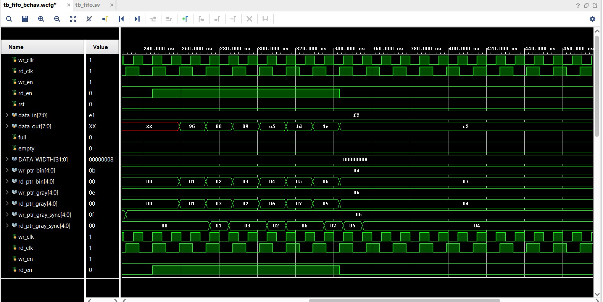
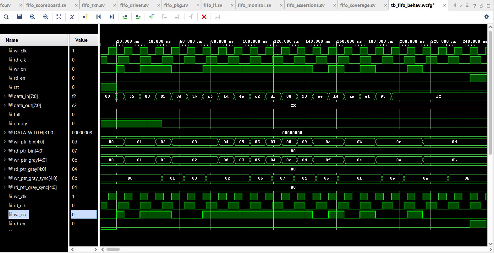

# Asynchronous FIFO with UVM Verification

A complete **Clock Domain Crossing (CDC)** design: an asynchronous FIFO with Gray-coded pointer synchronization, verified using a full **UVM testbench** with constrained-random stimulus, functional coverage, SVA assertions, and a reference-model scoreboard.


---

## Architecture

```
                    ┌──────────────────────────────────────────┐
                    │              fifo_top                     │
                    │                                          │
   wr_clk ────────►│  ┌─────────────┐    ┌──────────────┐     │
   wr_en  ────────►│  │ write_pointer│───►│ synchronizer │──┐  │
   data_in[7:0]───►│  │ (Gray code)  │    │  (2-stage)   │  │  │
                    │  └─────────────┘    └──────────────┘  │  │
                    │         │                              │  │
                    │         ▼                              ▼  │
                    │  ┌─────────────┐              ┌──────┐   │
                    │  │  fifo_mem   │              │ full │   │
                    │  │ (Dual-Port) │              │empty │   │
                    │  └─────────────┘              └──────┘   │
                    │         ▲                              ▲  │
                    │         │                              │  │
   rd_clk ────────►│  ┌─────────────┐    ┌──────────────┐  │  │
   rd_en  ────────►│  │ read_pointer │───►│ synchronizer │──┘  │
   data_out[7:0]◄──│  │ (Gray code)  │    │  (2-stage)   │     │
                    │  └─────────────┘    └──────────────┘     │
                    └──────────────────────────────────────────┘
```

## Key Design Features

| Feature | Implementation |
|---------|---------------|
| **Clock Domain Crossing** | Dual-clock architecture (independent wr_clk / rd_clk) |
| **Pointer Encoding** | Binary-to-Gray code conversion prevents multi-bit glitches |
| **Synchronization** | 2-stage flip-flop synchronizer on each pointer crossing |
| **Full Detection** | Gray-coded MSB comparison (inverted top 2 bits match) |
| **Empty Detection** | Gray-coded pointer equality check |
| **Memory** | Parameterized dual-port RAM (default: 16 x 8-bit) |
| **Parameters** | Configurable `DATA_WIDTH` and `ADDR_WIDTH` |

## UVM Verification Environment

```
┌─────────────────────────────────────────────────────┐
│                    fifo_test                         │
│  ┌───────────────────────────────────────────────┐  │
│  │                 fifo_env                       │  │
│  │                                                │  │
│  │  ┌──────────┐    ┌───────────┐                │  │
│  │  │ sequencer│───►│  driver   │───► DUT        │  │
│  │  └──────────┘    └───────────┘                │  │
│  │                                                │  │
│  │                  ┌───────────┐    ┌──────────┐ │  │
│  │           DUT───►│  monitor  │───►│scoreboard│ │  │
│  │                  │ (wr + rd) │    │(ref queue)│ │  │
│  │                  └─────┬─────┘    └──────────┘ │  │
│  │                        │                       │  │
│  │                        ▼                       │  │
│  │                  ┌───────────┐                  │  │
│  │                  │ coverage  │                  │  │
│  │                  │(cross cov)│                  │  │
│  │                  └───────────┘                  │  │
│  └───────────────────────────────────────────────┘  │
│                                                     │
│  ┌───────────────────────────────────────────────┐  │
│  │            fifo_assertions (SVA)              │  │
│  │  • No write when full    • Reset → empty      │  │
│  │  • No read when empty    • Full/empty mutex   │  │
│  └───────────────────────────────────────────────┘  │
└─────────────────────────────────────────────────────┘
```

### Verification Components

| Component | File | Purpose |
|-----------|------|---------|
| **Transaction** | `fifo_txn.sv` | Constrained-random sequence item (wr_en, rd_en, data) |
| **Driver** | `fifo_driver.sv` | Drives stimuli on both write and read clock domains |
| **Monitor** | `fifo_monitor.sv` | Passively observes write and read ports via analysis ports |
| **Scoreboard** | `fifo_scoreboard.sv` | Reference queue model — checks FIFO ordering and data integrity |
| **Coverage** | `fifo_coverage.sv` | Functional coverage: data ranges, full/empty, simultaneous R/W cross-coverage |
| **Assertions** | `fifo_assertions.sv` | SVA: overflow protection, underflow protection, reset, full/empty mutex |
| **Test** | `fifo_test.sv` | 500-txn random sequence + write-burst overflow test |

### Test Scenarios

| Test | What It Verifies |
|------|-----------------|
| **Random (500 txns)** | General read/write interleaving across clock domains |
| **Write Burst** | Fill FIFO to full → verify full flag → drain completely → verify empty flag |
| **Overflow** | Write when full — assertion checks data is not corrupted |
| **Underflow** | Read when empty — assertion checks no invalid data is read |

## Simulation Results

Waveforms from ModelSim showing correct Gray-coded pointer synchronization, full/empty flag generation, and data integrity across clock domains:




## Project Structure

```
async-fifo-uvm-verification/
├── rtl/
│   ├── fifo_top.v           # Top-level async FIFO
│   ├── write_pointer.v      # Write pointer + Gray code
│   ├── read_pointer.v       # Read pointer + Gray code
│   ├── synchronizer.v       # 2-stage CDC synchronizer
│   └── fifo_mem.v           # Dual-port memory
├── tb/
│   ├── fifo_pkg.sv          # UVM package
│   ├── fifo_if.sv           # Interface with clocking blocks
│   ├── fifo_txn.sv          # Transaction / sequence item
│   ├── fifo_driver.sv       # Driver
│   ├── fifo_monitor.sv      # Monitor (write + read ports)
│   ├── fifo_scoreboard.sv   # Scoreboard with reference model
│   ├── fifo_coverage.sv     # Functional coverage
│   ├── fifo_assertions.sv   # SVA protocol assertions
│   ├── fifo_env.sv          # UVM environment
│   └── fifo_test.sv         # Test + sequences
├── docs/
│   ├── waveform_write.png   # Simulation waveform (write side)
│   └── waveform_read.png    # Simulation waveform (read side)
└── README.md
```

## How to Run

```bash
# ModelSim
vlib work
vlog rtl/*.v
vlog -sv tb/*.sv +incdir+tb
vsim -novopt fifo_test +UVM_TESTNAME=fifo_test -do "run -all"
```

## Tools Used

- **RTL Design:** Verilog HDL
- **Verification:** SystemVerilog, UVM 1.2
- **Simulator:** ModelSim / QuestaSim
- **Waveform Viewer:** ModelSim Wave

## Author

**Bhavin Umatiya** — [LinkedIn](https://www.linkedin.com/in/bhavin-umatiya/) · [GitHub](https://github.com/Bhavin-umatiya)

## License

MIT License — see [LICENSE](LICENSE) for details.
